# Trabalho 4 - Desenvolvimento de Software para Nuvem

## 1. Ambiente utilizado

* AWS S3 para armazenamento dos dados.
* Jupyter Notebooks com Linguagem Scala e Framework Spark para o processamento dos dados.
* Jupyter Notebooks com Linguagem Python e Framework Pandas para criação dos gráficos e tabelas.
* Os notebooks Scala foram usados em um cluster do AWS Elastic Map Reduce com a seguinte configuração:
  
  * 1 Master [m5.xlarge](https://aws.amazon.com/pt/ec2/instance-types/)
  * 2 Cores [m5.xlarge](https://aws.amazon.com/pt/ec2/instance-types/)

* Versão do EMR: 6.1.0
* Versão do Spark: 3.0.0
* Versão do Pandas: 1.0.5
#
## 2. Primeira Questão

### 2.1 Pré-Processamento dos Dados

O dataset da primeira questão possui 32 colunas, mas a maioria delas não seria útil para responder às perguntas propostas, por conta disso várias colunas foram dropadas. Em seguida, foram feitas operações para gerar as colunas *date* e *id*. O dataset pré-processado foi salvo no S3 no formato *parquet*, que é o formato favorito do Spark.

No começo do notebook [questao-1](https://github.com/titowoche30/spark-big-data-analysis/blob/main/scala/questao-1.ipynb) foi criada uma coluna chamada *hashtags*, que possui as hashtags utilizadas em cada tweet.

O dataset a ser utilizado possui as colunas: *id*, *tweets*, *date* e *hashtags*.

### 2.2 a) Quais foram as hashtags mais usadas pela manhã, tarde e noite?

Para responder essa pergunta foi necessário:

* Retirar os campos que não tinham hashtags.
* Pegar os registros com *date* entre 5 e 12 horas (manhã) ou 13 e 18 horas (tarde) ou 19 e 4 horas (noite).
* Agrupar e agregar pela coluna *hashtags*.

**As 15 hashtags mais usadas pela manhã**

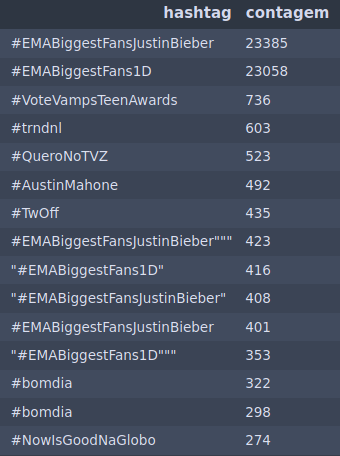

**As 15 hashtags mais usadas pela tarde**

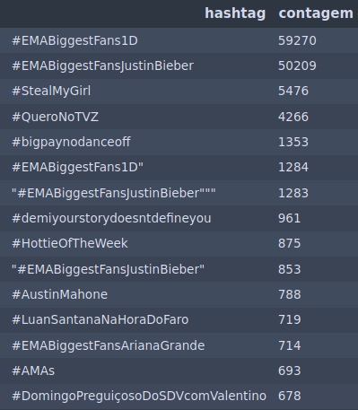

**As 15 hashtags mais usadas pela noite**

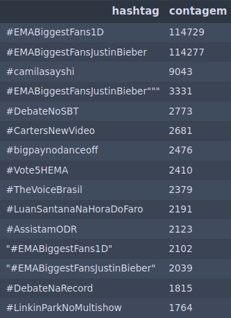

### 2.3 b) Quais as hashtags mais usadas em cada dia?

Para responder essa pergunta foi necessário:

* Retirar os campos que não tinham hashtags.
* Pegar os registros de cada dia específico (15, 16, 17, 18, 19 e 20).
* Agrupar e agregar pela coluna *hashtags*.

**As 15 hashtags mais usadas no dia 15/10/2014**

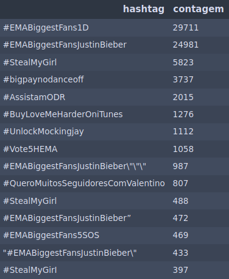

**As 15 hashtags mais usadas no dia 16/10/2014**

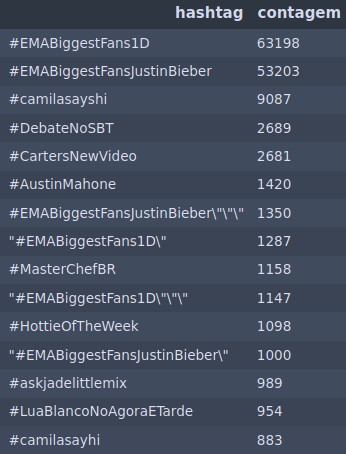

**As 15 hashtags mais usadas no dia 17/10/2014**

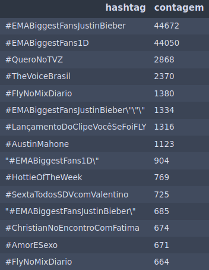

**As 15 hashtags mais usadas no dia 18/10/2014**

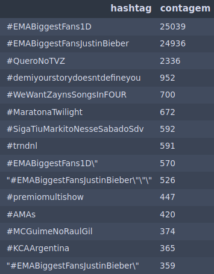

**As 15 hashtags mais usadas no dia 19/10/2014**

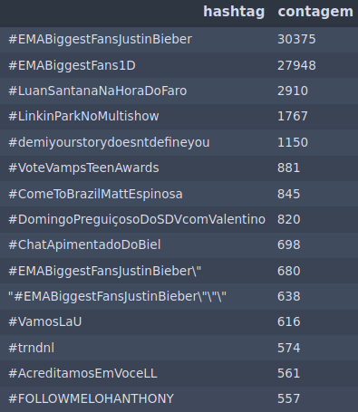

**As 15 hashtags mais usadas no dia 20/10/2014**

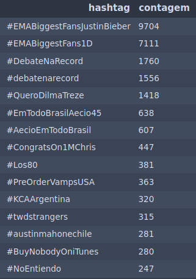

### 2.4 c) Qual o número de tweets por hora a cada dia?

Para responder essa pergunta foi necessário:

* Pegar os registros de cada dia específico (15, 16, 17, 18, 19 e 20).
* Criar uma coluna chamada *hora* a partir da coluna *date*.
* Agrupar pela coluna *hora* e agregar pela coluna *tweets*.

**Número de tweets por hora no dia 15/10/2014**

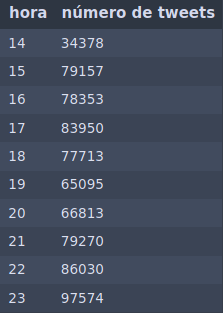

**Número de tweets por hora no dia 16/10/2014**

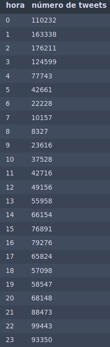

**Número de tweets por hora no dia 17/10/2014**

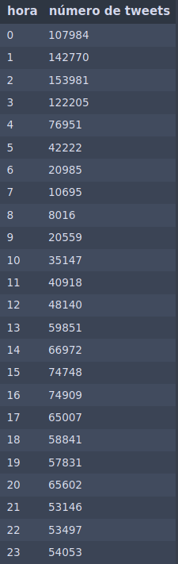

**Número de tweets por hora no dia 18/10/2014**

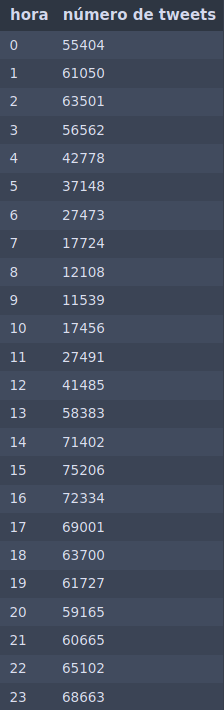

**Número de tweets por hora no dia 19/10/2014**

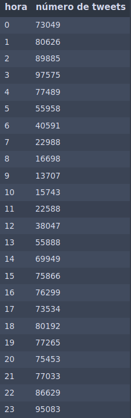

**Número de tweets por hora no dia 20/10/2014**

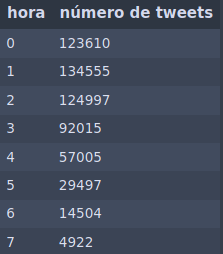

**Séries temporais do número de tweets por dia**

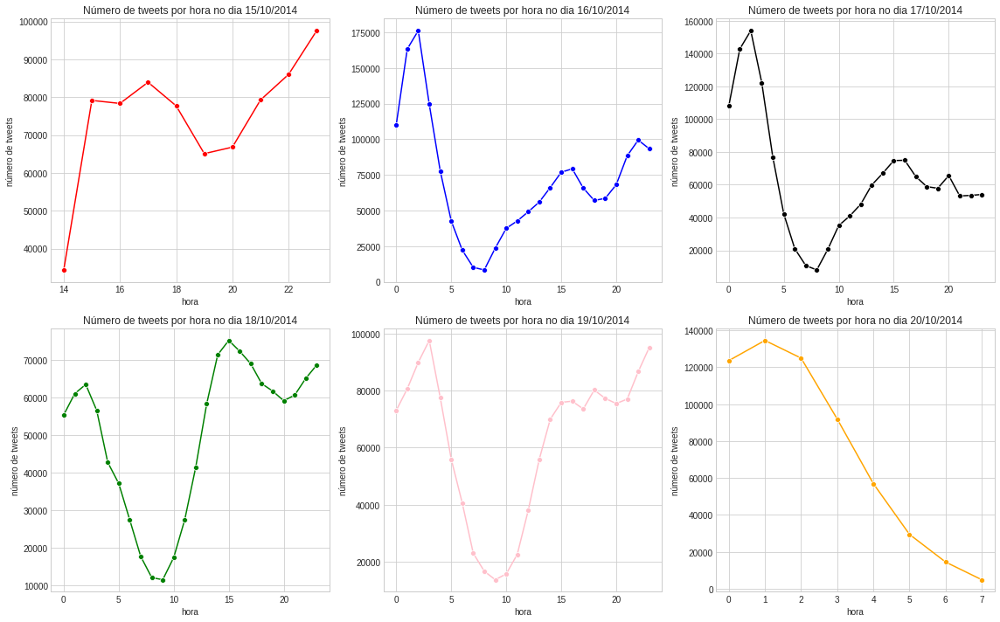

### 2.5 d) Quais as principais sentenças relacionadas à palavra “Dilma”?

Para responder essa pergunta foi necessário:

* Definir uma sentença como um conjunto(sub-string) de 40 caracteres dentro dos tweets.
* Dividir os tweets em conjuntos de 40 caracteres.
* Como a divisão por 40 caracteres pode gerar uma última sub-string com menos de 40 caracteres, foi necessário pegar somente as sentenças com 40 caracteres.
* Pegar as sentenças que continham *"dilma"* e que não fossem hashtags.
* Agrupar e agregar pelas sentenças.

**As 15 principais sentenças relacionadas à palavra “Dilma”**

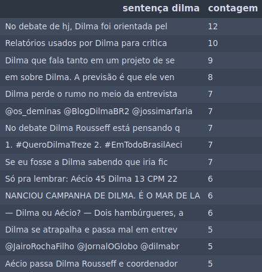

### 2.6 e) Quais as principais sentenças relacionadas à palavra “Aécio”?

Para responder essa pergunta foi necessário:

* Definir uma sentença como um conjunto(sub-string) de 40 caracteres dentro dos tweets.
* Dividir os tweets em conjuntos de 40 caracteres.
* Trocar as ocorrências das palavras "aécio" por "aecio" e "Aécio" por "Aecio".
* Como a divisão por 40 caracteres pode gerar uma última sub-string com menos de 40 caracteres, foi necessário pegar somente as sentenças com 40 caracteres.
* Pegar as sentenças que continham *"aecio"* e que não fossem hashtags.
* Agrupar e agregar pelas sentenças.

**As 15 principais sentenças relacionadas à palavra “Aecio”**

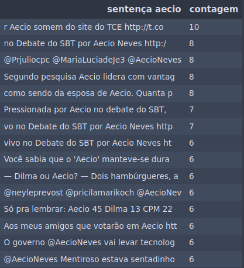

#
## 3. Segunda Questão

### 3.1 Pré-Processamento dos Dados

O dataset da segunda questão era um json aninhado com 16 campos no total, mas a maioria dos campos não seria útil para responder às perguntas propostas, por conta disso vários campos foram dropados. Em seguida, foram feitas operações para gerar a coluna Date. O dataset pré-processado foi salvo no S3 no formato *parquet*, que é o formato favorito do Spark.

O dataset a ser utilizado possui as colunas: *id*, *text*, *title* e *date*.

### 3.2 a) Encontre as palavras mais utilizadas nas avaliações

Para responder essa pergunta foi necessário:

* Criar uma coluna chamada *word* que contém todas as palavras de todos os reviews(coluna *text*) e deixar todas em Lower Case.
* Pegar somente as palavras com mais de 4 caracteres.
* Agrupar e agregar pela coluna *word*.

**As 15 palavras mais utilizadas nas avaliações**

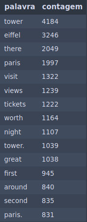

### 3.3 b) Encontre as expressões mais usadas

Para responder essa pergunta foi necessário:

* Definir uma expressão como um conjunto(sub-string) de 45 caracteres dentro dos tweets.
* Preencher os campos nulos em *text* com " "
* Dividir os reviews em conjuntos de 45 caracteres.
* Criar uma coluna chamada *Expr* que contém todos os conjuntos de 45 caracteres de todos os reviews.
* Como a divisão por 45 caracteres pode gerar uma última sub-string com menos de 45 caracteres, foi necessário pegar somente as sentenças com 45 caracteres.
* Agrupar e agregar pela coluna *Expr*.

**As 15 expressões mais utilizadas nas avaliações**

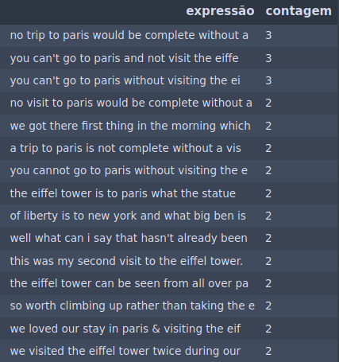

### 3.4 c) Encontre os principais tópicos relacionados às revisões

Para responder essa pergunta foi necessário:

* Definir um tópico como uma palavra com mais de 3 caracteres e menos de 16.
* Criar uma coluna chamada *word* que contém todas as palavras da coluna *title* e deixar todas em Lower Case.
* Pegar só as palavras com com mais de 3 caracteres e menos de 16.
* Agrupar e agregar pela coluna *word*.

**Os 15 principais tópicos relacionados às revisões**

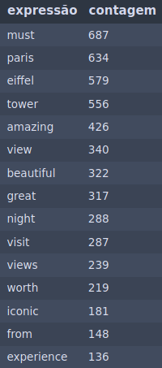

### 3.5 d) Mapeie a distribuição temporal das revisões

Para responder essa pergunta foi necessário:

* Agrupar e agregar pela coluna *Date*
  
**Distribuição temporal das revisões em 2015, 2016 e 2017**

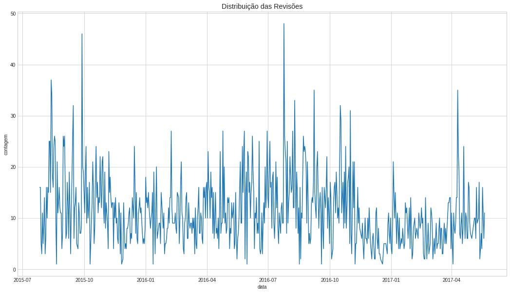

**Distribuição temporal das revisões em 2015**

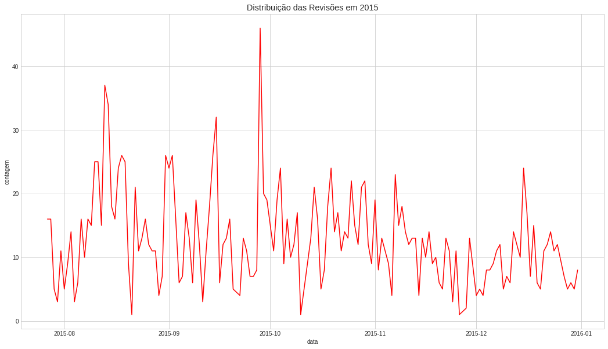

**Distribuição temporal das revisões em 2016**

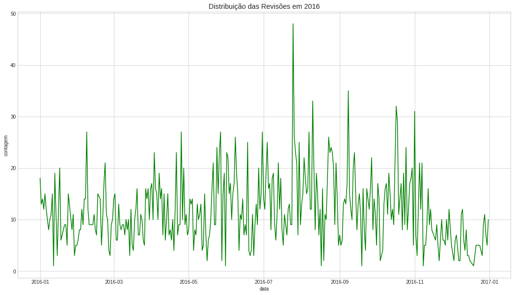

**Distribuição temporal das revisões em 2017**

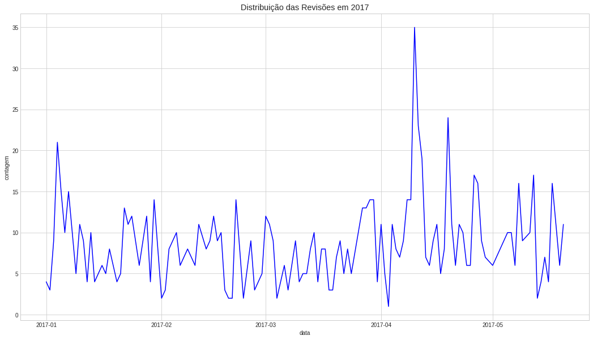

#
## 4. Considerações finais

Todo o código desenvolvido e todas as imagens geradas estão disponíveis nesse [repositório](https://github.com/titowoche30/spark-big-data-analysis/).